# A Short Tutorial for RSEM

[Bo Li](http://bli25ucb.github.io/)

* * *

## Table of Contents

* [Introduction](#intro)
* [Prerequisites](#prereq)
* [Build References](#build_ref)
* [Single Sample Analysis](#single)
* [Differential Expression Analysis using EBSeq](#ebseq)
* [Simulation](#simulation)

* * *

## <a name="intro"></a> Introduction

RSEM<sup>[1](http://bioinformatics.oxfordjournals.org/content/26/4/493.long),[2](http://www.biomedcentral.com/1471-2105/12/323)</sup> is an RNA-Seq transcript quantification program developed in 2009. In this tutorial, we will use some single cell RNA-Seq data from [Shalek *et al.*](http://www.nature.com/nature/journal/v510/n7505/full/nature13437.html) to demonstrate the common uses of RSEM.

The Shalek *et al.* study contains thousands of single cell RNA-Seq experiments from bone-marrow-derived mouse dendritic cells. These data are available at [GSE48968](http://www.ncbi.nlm.nih.gov/geo/query/acc.cgi?acc=GSE48968). In this tutorial, we first analyze one paired-end RNA-Seq data set from a single dendritic cell sequenced 6 hours after lipopolysaccharide (LPS) stimulation. Then we demonstrate how to perform differential expression analysis on two groups of single cells. Lastly, we show how we can use the RSEM simulator to help us design sequencing experiments.

<!---
LPS is a component of Gram-negative bacteria
-->

Please note that this tutorial cannot replace the [RSEM manual](http://deweylab.github.io/RSEM/README.html). In order to make full use of RSEM, we still recommend you to go over the manual.

## <a name="prereq"></a> Prerequisites

You need a server with Linux/Mac OS. To run RSEM, your server should have C++, Perl and R installed. In addition, you need at least one aligner to align RNA-Seq reads for you. RSEM can call [Bowtie](http://bowtie-bio.sourceforge.net/index.shtml), [Bowtie 2](http://bowtie-bio.sourceforge.net/bowtie2/index.shtml) or [STAR](https://github.com/alexdobin/STAR) for you if you have them installed. Last but not least, you need to install the latest version of RSEM.

In this tutorial, we align reads with Bowtie 2. We will show you how to install Bowtie 2 and RSEM step by step. 

First, clone the following git repository to your favorite location:

```
git clone git@github.com:bli25ucb/RSEM_tutorial.git $(your_favorite_location)
cd $(your_favorite_location)
```

You will find source codes for Bowtie 2 and RSEM in the `software` subdirectory. Type commands below to install them:

```
cd software
unzip bowtie2-2.2.6-source.zip
cd bowtie2-2.2.6
make -j 8
cd ..
tar -xzf RSEM-1.2.25.tar.gz
cd RSEM-1.2.25
make -j 8
make ebseq
cd ..
cd ..
```

In the above commands, `make -j 8` asks for 8 threads to compile the software. We always use 8 threads for parallelization through this tutorial. However, you should adjust this number according to your needs. `make ebseq` compiles EBSeq and is only required if you want to use EBSeq for differential expression analysis.

## <a name="build_ref"></a> Build References

RSEM works with a set of transcripts, instead of a genome.  We have two ways to build RSEM transcript references: building references from a genome, or buidling references from a set of transcripts. The RSEM command to build references is `rsem-prepare-reference`.

1. Building references from a genome. RSEM can extract transcript sequences from the genome based on a given GTF file. Optionally, RSEM can also call Bowtie/Bowtie2/STAR to build their own indices.

 Download the Ensembl mouse genome (ftp://ftp.ensembl.org/pub/release-82/fasta/mus_musculus/dna/Mus_musculus.GRCm38.dna.toplevel.fa.gz) and GTF (ftp://ftp.ensembl.org/pub/release-82/gtf/mus_musculus/Mus_musculus.GRCm38.82.chr.gtf.gz) files to the `ref` subdirectory. Then type the following commands to build the references and create Bowtie2 indices:

 ```
 gunzip ref/Mus_musculus.GRCm38.dna.toplevel.fa.gz
 gunzip ref/Mus_musculus.GRCm38.82.chr.gtf.gz
 software/RSEM-1.2.25/rsem-prepare-reference --gtf ref/Mus_musculus.GRCm38.82.chr.gtf \
 					     --bowtie2 --bowtie2-path software/bowtie2-2.2.6 \
					     ref/Mus_musculus.GRCm38.dna.toplevel.fa ref/mouse_ref
 ```

 The figure below lists files generated by the above commands. `mouse_ref.transcripts.fa` contains all extracted transcript sequences, and `*.bt2` are Bowtie2 indices.  

 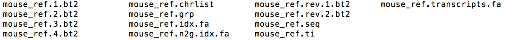

 Let us take a closer look at `mouse_ref.transcripts.fa` (a snippet is shown below). It is a multi-FASTA file containing extracted sequences. For each sequence, the first line provides its identifier and the second line provides its sequence.

 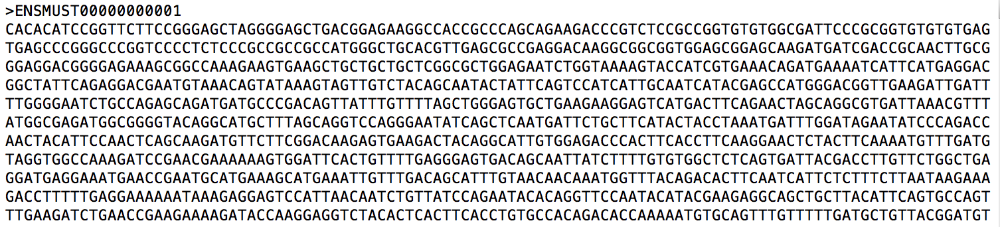

 If you want to skip the reference building step, you can download the [prebuilt references](https://www.dropbox.com/s/lixp07odna0wpxn/mouse_ref.tar.gz?dl=0) to `ref` and untar it by typing:

 ```
 tar -C ref -xzf ref/mouse_ref.tar.gz
 ```

2. Building references from a set of transcripts. If we only have a *de novo* assembled transcriptome, we have to build references directly from transcripts. In this case, if we want to quantify gene-level expression, we need to provide RSEM a map from isoforms to genes using the `--transcript-to-gene-map` option. RSEM is also able to quantify allele-specific expression. To quantify allele-specific expression, we need to build RSEM references from phased sequences and provide RSEM a map from phased haplotypes to isoforms and then to genes using the `--allele-to-gene-map` option.

 Download [mouse transcripts and the associated mapping file](https://www.dropbox.com/s/ie67okalzaw8zzj/mouse_ref_building_from_transcripts.tar.gz?dl=0) to `ref`, and untar the tarball by

 ```
 tar -C ref -xzf ref/mouse_ref_building_from_transcripts.tar.gz
 ```

 You should see two files: `mouse_ref.fa` and `mouse_ref_mapping.txt`. `mouse_ref.fa` is a multi-FASTA file containing all Ensembl mouse transcripts. Each transcript's identifier is a concatenation of its transcript_id and transcript_name (separated by a '_' sign). `mouse_ref_mapping.txt` is a mapping from transcripts to genes. As shown in the snippet below, each line of the mapping file contains a gene identifier and a transcript identifier.

 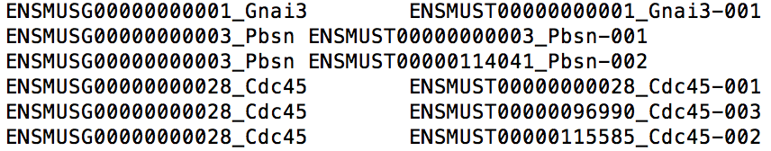

 Type the following command to build references from the Ensembl mouse transcripts:

 ```
 software/RSEM-1.2.25/rsem-prepare-reference \
 					     --transcript-to-gene-map ref/mouse_ref_mapping.txt \
 					     --bowtie2 --bowtie2-path software/bowtie2-2.2.6 \
					     ref/mouse_ref.fa ref/mouse_ref 
 ```

## <a name="single"></a> Single Sample Analysis

### Run RSEM on a single cell RNA-Seq data set

Great. Now we are ready to play with some real data!

First, please download this [file](https://www.dropbox.com/s/pxvokduywrul5nu/SRR937564.zip?dl=0) to your `data` subdirectory and unzip it:

```
unzip data/SRR937564.zip
```

It contains around 1 million 101bp-long paired-end reads sequenced from a single dendritic cell at 6h post-stimulation with LPS (Note: the original data file can be found at [here](http://trace.ncbi.nlm.nih.gov/Traces/sra/?run=SRR937564)). 

Then type the following command to run RSEM on this data set. I'll explain the meaning of each option/parameter later. 

```
software/RSEM-1.2.25/rsem-calculate-expression -p 8 --paired-end \				
					--bowtie2 --bowtie2-path software/bowtie2-2.2.6 \
					--estimate-rspd \
					--append-names \
					--output-genome-bam \
					data/SRR937564_1.fastq data/SRR937564_2.fastq \
					ref/mouse_ref exp/LPS_6h
```

In the above command, `-p 8` tells RSEM to use 8 threads and `--paired-end` indicates the input reads are paired-end. In the second line, we tell RSEM to align reads using Bowtie 2, which is located at `software/bowtie2-2.2.6`. In the third line, we turn on the `--estimate-rspd` option because we wonder if there is any sequencing bias in the data. `--estimate-rspd` enabls RSEM to learn from data how the reads are distributed across a transcript. The learned statistics can help us assess if any positional biases are shown in the data. In the fourth line, `--append-names` tells RSEM to append gene_name/transcript_name to the result files. By default, RSEM generates an annotated BAM file in transcript coordinates. Sometimes, we want the alignments in genomic coordinates instead. Thus, we turn on the `--output-genome-bam` option in the fifth line. Note that this option is only available when you build references from a genome. Then in the sixth line, we provide RSEM with two FASTQ files, which contain the first and second mates of the paired-end reads. In the last line, we tell RSEM where the references locate and where to output the results.

Because the reads are long (101bp), it might take a while for Bowtie 2 to align all reads. If you do not want to wait, you can download the [Bowtie 2 alignments in BAM format](https://www.dropbox.com/s/ulfpyi0qljv8vk4/LPS_6h.bam?dl=0) to subdirectory `exp`, and then type the following command to run RSEM:

```
software/RSEM-1.2.25/rsem-calculate-expression -p 8 --paired-end \
					--bam \
					--estimate-rspd \
					--append-names \
					--output-genome-bam \
					exp/LPS_6h.bam \
					ref/mouse_ref exp/LPS_6h
```

Note that the `--bam` option tells RSEM the input is a BAM file, instead of a pair of FASTQ files.  

When RSEM finishes, You can find its outputs at the `exp` subdirectory. As shown in the snapshot below, all files share the prefix 'LPS_6h' in their names. Among the files, `LPS_6h.genes.results` and `LPS_6h.isoforms.results` contain the estimated gene and isoform level expressions. `LPS_6h.transcript.bam`, `LPS_6h.transcript.sorted.bam` and `LPS_6h.transcript.sorted.bam.bai` describe the annotated alignments in transcript coordinates. `LPS_6h.genome.bam`, `LPS_6h.genome.sorted.bam` and `LPS_6h.genome.sorted.bam.bai` describe the annotated alignments in genomic coordinates. `LPS_6h.stat` is a folder that contains model parameters learned from the real data.

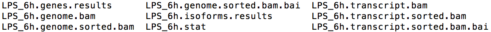

You can find a detailed explanation of each output file at [here](http://deweylab.github.io/RSEM/rsem-calculate-expression.html#OUTPUT). Let us look at `LPS_6h.isoforms.results` and `LPS_6h.genome.sorted.bam` more closely. Below is a snippet of `LPS_6h.isoforms.results`:

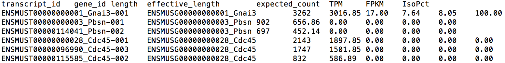

The first two columns of this file give the transcript ID and its parent gene's ID for each transcript. Note that you can find the transcript/gene name at the end of each ID. The sixth column gives the expression level for each isoform in TPM (Transcript per Million). TPM is a relative measure of expression levels. It represents the number of copies each isoform should have supposing the whole transcriptome contains exactly 1 million transcripts. The fifth column provides the expected read count in each transcript, which can be utilized by tools like [EBSeq](https://www.bioconductor.org/packages/release/bioc/html/EBSeq.html), [DESeq](https://bioconductor.org/packages/release/bioc/html/DESeq2.html) and [edgeR](https://bioconductor.org/packages/release/bioc/html/edgeR.html) for differential expression analysis. The format of gene-level result file, `LPS_6h.genes.results`, is very similar.

`LPS_6h.genome.sorted.bam` is mainly used for visualization. Each alignment in this file is sorted in ascending order by its chromosome name and genomic coordinate. Look at the snippet below, you can find each alignment is also annotated with a `ZW:f:value` field. The ZW field gives the posterior probability that this alignment is true. In addition, the MAPQ field (5th field) is re-calculated based on the ZW value to reflect RSEM's confidence on each alignment.

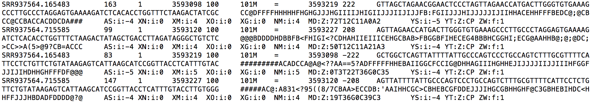

### Explore the data

First, let us take a look at the highest expressed genes. Please switch to the `exp` subdirectory (by command `cd exp`) and type the following `R` commands:

```
data = read.table("LPS_6h.genes.results", header=T, stringsAsFactors=F)
idx = order(data[,"TPM"], decreasing=T)
data[idx[1:10], c("gene_id", "expected_count", "TPM")]
```

The above `R` commands list the top 10 highest expressed genes (shown below). Among the list, we can find several immune system related genes, such as Lyz2, Ccl6, Ccl5, which reassures us that the data are produced from a bone-marrow-derived dendritic cell. 

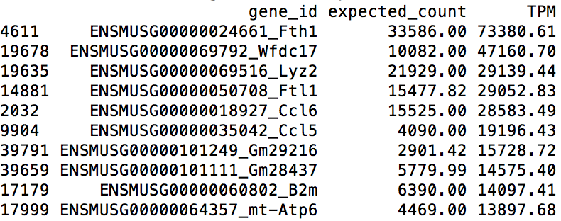

Then let us focus on the data statistics learned by RSEM. Quit `R` and type the following command in the terminal:

```
../software/RSEM-1.2.24/rsem-plot-model LPS_6h LPS_6h_diagnostic.pdf
```

Command `rsem-plot-model` plots the model statistics RSEM learned from the data. The resulting file, `LPS_6h_diagnostic.pdf` contains plots of learned fragment length distribution, read length distribution, read start position distribution, quality score information and alignment statistics. For example, the below figure shows the read start position distribution (RSPD) learned from the single cell data.

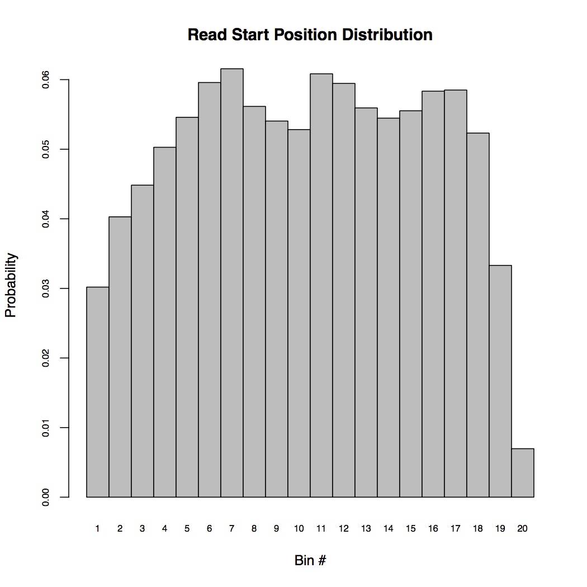

RSPD partitions each transcript into 20 bins and counts the frequency of reads starting at each bin. By examing the above RSPD, we notice that there are biases toward the ends of transcripts. This is reasonable because the sample was prepared using Nextera<sup>TM</sup> transposons and it is known that these transposons are hard to reach the ends.

The quality score plot is shown below. It plots the observed quality against the theoretical quality for each nucleotide and quality score. we observe that in general, sequencing error decreases as the quality score increases. In addition, the theoretical quality score is more optimistic than the actural quality learned from the data.

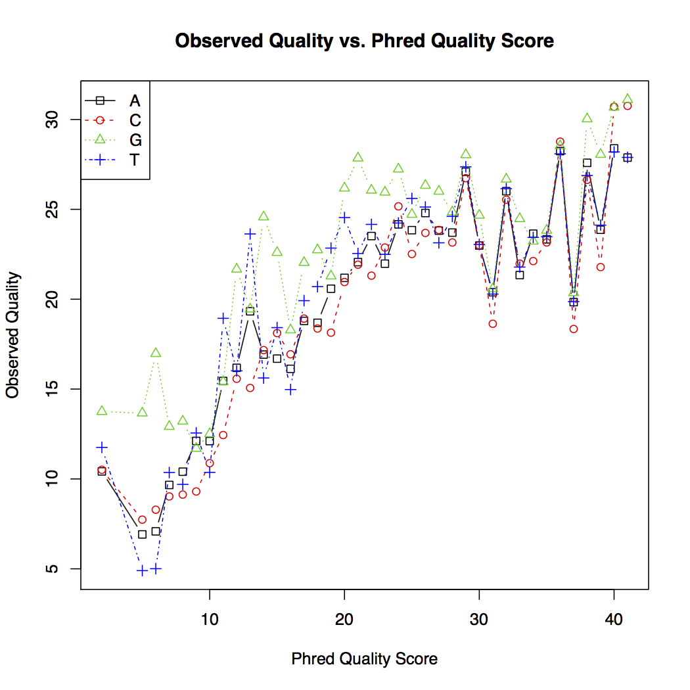

The alignment statistics plot (shown below) is another interesting figure to look at. In this plot, unalignable reads, uniquely mapped reads, multi-mapping reads and reads filtered due to too many alignments are represented by colors of green, blue, grey and red. The x-axis of the histogram categorizes reads by their number of alignments to the transcript sequences. Then y-axis records the number of reads belonging to each category. We also have a pie chart at the top-right corner showing the percentages in the data for the previously described four types of reads. Based on the pie chart, we can see that there are much more multi-mapping reads (35%) than uniquely mapped reads (29%). 

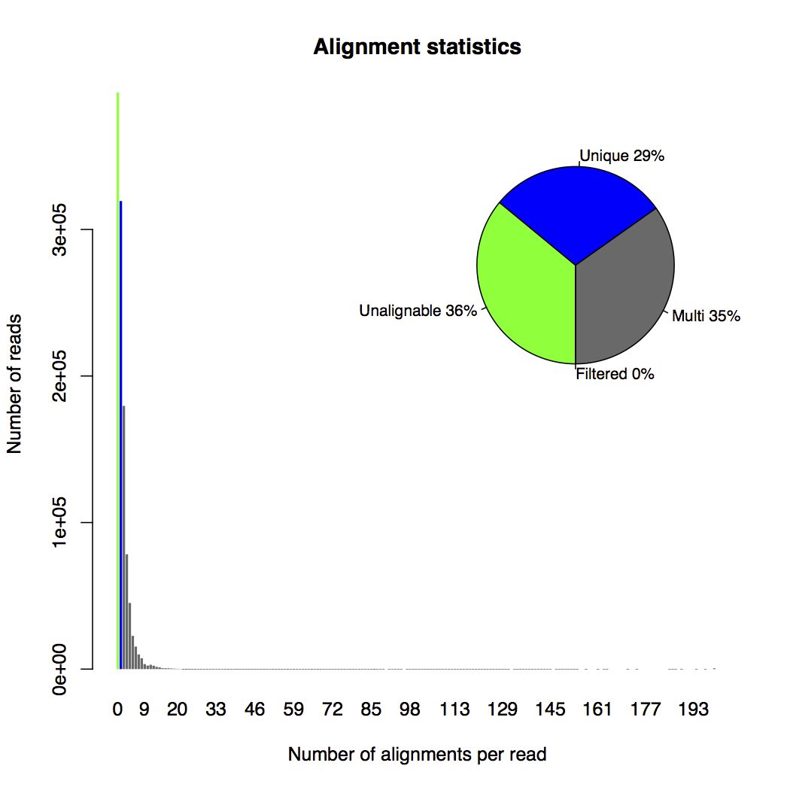

### Visualize the alignments

Let us look at Ccl6, one of the top 10 expressed genes. This gene contains 3 isoforms: Ccl6-001, Ccl6-002, and Ccl6-003. Their splicing graphs are liste below (adopted from [here](http://uswest.ensembl.org/Mus_musculus/Location/View?db=core;g=ENSMUSG00000018927;r=11:83583216-83595066;t=ENSMUST00000138145)):

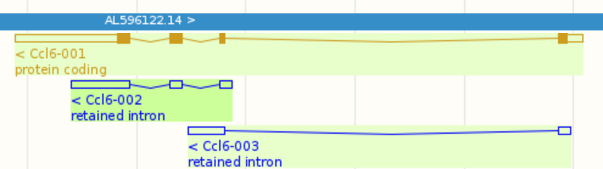

In fact, it is very challenging to estimate isoform level expressions accurately for Ccl6 because Ccl6-002 is almost a subsequence of Ccl6-001 and Ccl6-003 also shares a portion of its sequences with Ccl6-001. We can find the following RSEM estimated isoform expression levels from `LPS_6h.isoforms.results`:

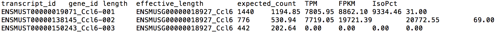

RSEM inferred that Ccl6-001 composes 31% of the Ccl6 gene in the transcriptome, Ccl6-002 composes 69%, and Ccl6-003 is not expressed. But how did RSEM make these conclusions? The stacked transcript wiggle plots for gene Ccl6 can provide us some hints. Wiggle plot is a way of displaying read depth at each transcript/genomic position. You can find a detailed description of its format from [here](http://genome.ucsc.edu/goldenpath/help/wiggle.html). The stacked wiggle plots RSEM generate stack the expected multi-mapping read depth (shown in red) over the uniquely aligned read depth (shown in black).

To generate the stacked transcript wiggle plots for Ccl6, type the following command:

```
../software/RSEM-1.2.24/rsem-plot-transcript-wiggles --gene-list --show-unique \
						     LPS_6h gene_ids.txt Ccl6_transcript_wiggle.pdf
```

Note that `gene_ids.txt` is already in the `exp` subdirectory and it contains the gene id of Ccl6.

In the generated figure (`Ccl6_transcript_wiggle.pdf`) shown below, black refers to uniquely aligned reads and red refers to the expected weight from multi-mapping reads. We can easily see that there is no uniquely mapped reads in Ccl6-002. Then why did RSEM assign more weights to Ccl6-002 than Ccl6-001 in the shared region? The reason is that RSEM tries to match read depth between different regions of isoform Ccl6-001. Thus, it needs to move extra weights to Ccl6-002. Ccl6-003 is marked as not expressed because there is no reads aligned to it.  


We can also visualize the read coverage and alignments information for gene Ccl6 in the genome. Let us first generate a genome-wide wiggle plot from the sorted RSEM genomic BAM file:

```
../software/RSEM-1.2.24/rsem-bam2wig LPS_6h.genome.sorted.bam LPS_6h.wig LPS_6h
```

Then you need to install the Integrative Genomic Viewer (IGV) from [here](http://www.broadinstitute.org/software/igv/). Once IGV is installed, we can load the mouse reference genome from the file `Mus_musculus.GRCm38.dna.toplevel.fa`, which locates at `ref` (shown below).

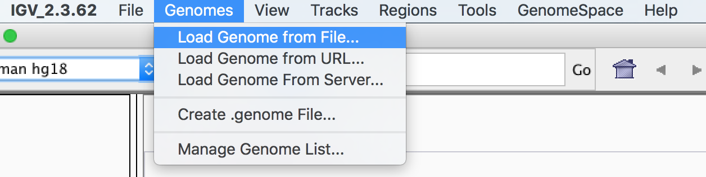

If you haven't downloaded the mouse genome to `ref`, you can choose to load genome from server instead: Click 'Genomes' and then 'Load Genome From Server'.

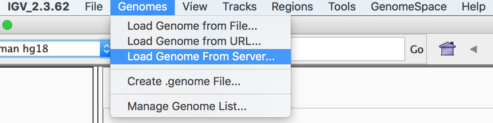

After that choose `Mouse mm10`.  
   
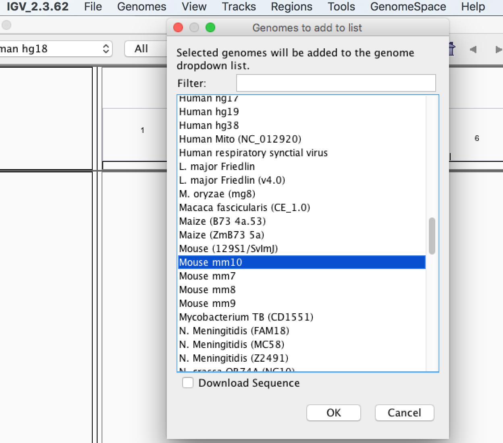

The next step is to load the wiggle and BAM files: Click 'File', 'Load from File', and then choose `LPS_6h.wig` to upload the wiggle file. Then repeat it and choose `LPS_6h.genome.sorted.bam` to load the sorted BAM file.

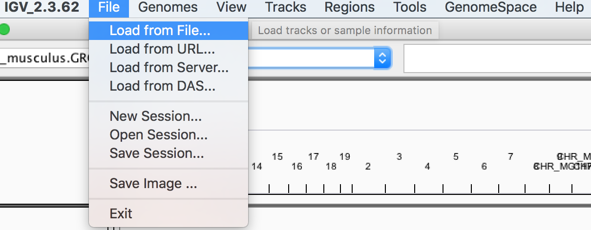

The last step is to locate the Ccl6 gene. Type `11:83,587,153-83,593,815` to IGV's position input box as shown below and then click 'Go'. 

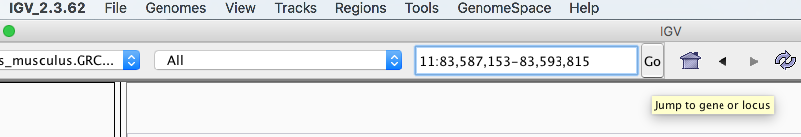

Now we can see the wiggle plot and BAM alignments at Ccl6 (shown below).

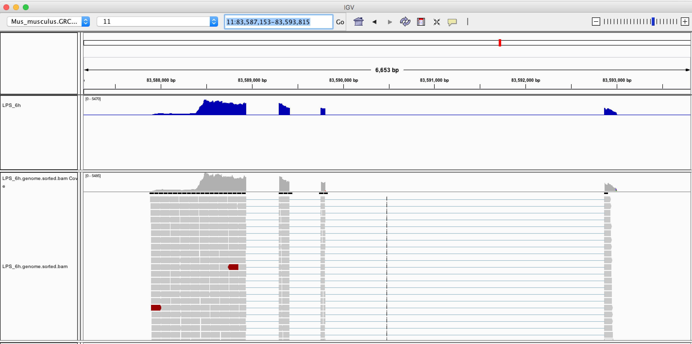

We can find that the shape of genomic wiggle plot is reversed. This is because Ccl6 locates at the reverse strand of chromosome 11. 

## <a name="ebseq"></a> Differential Expression Analysis using EBSeq

Differential expression analysis is one of the most common tasks biologists perform. The RSEM software includes the [EBSeq](https://www.bioconductor.org/packages/devel/bioc/html/EBSeq.html) package for downstream differential expression analysis. Let us play with the RSEM-EBSeq pipeline on some real single cell data sets.

### Detecting differentially expressed genes

Sample Name | SRA Run ID | Number of Reads | Condition
----------- | ---------- | --------------- | ---------
LPS_6h 	    | [SRR937564](http://trace.ncbi.nlm.nih.gov/Traces/sra/?run=SRR937564) | 1,093,275 | 6h post-stimuation with LPS
LPS_6h_2    | [SRR937558](http://trace.ncbi.nlm.nih.gov/Traces/sra/?run=SRR937558) | 1,029,972 | 6h post-stimuation with LPS
LPS_6h_3    | [SRR937568](http://trace.ncbi.nlm.nih.gov/Traces/sra/?run=SRR937568) | 1,339,876 | 6h post-stimuation with LPS
Unstimulated	| [SRR937920](http://trace.ncbi.nlm.nih.gov/Traces/sra/?run=SRR937920) | 1,409,495 | unstimulated
Unstimulated_2	| [SRR937927](http://trace.ncbi.nlm.nih.gov/Traces/sra/?run=SRR937927) | 1,526,289 | unstimulated
Unstimulated_3	| [SRR937946](http://trace.ncbi.nlm.nih.gov/Traces/sra/?run=SRR937946) | 1,548,816 | unstimulated

The single cell data listed in above consist of 6 samples in two conditions: 6h post-stimulation with LPS and unstimulated. Each condition contains 3 biological replicates. The first sample 'LPS_6h' is the one we have used in our previous analyses. Please download the [RSEM-estimated expression levels](https://www.dropbox.com/s/r9xrcxrzxfzwqqe/expression_levels_for_DE_analysis.zip?dl=0) for these 6 samples to subdirectory `exp`. Then type the following commands to detect differentially expressed genes:

```
unzip -u expression_levels_for_DE_analysis.zip
../software/RSEM-1.2.24/rsem-generate-data-matrix LPS_6h.genes.results \
						  LPS_6h_2.genes.results LPS_6h_3.genes.results \ 
						  Unstimulated.genes.results Unstimulated_2.genes.results \
						  Unstimulated_3.genes.results > GeneMat.txt
../software/RSEM-1.2.24/rsem-run-ebseq GeneMat.txt 3,3 GeneMat.results
../software/RSEM-1.2.24/rsem-control-fdr GeneMat.results 0.05 GeneMat.de.txt
```

In the above commands, `rsem-generate-data-matrix` extracts the estimated expected counts from each sample and then generates a count matrix `GeneMat.txt` that can be used by `EBSeq`. Then `rsem-run-ebseq` runs `EBSeq`. It takes as inputs the gene count matrix (`GeneMat.txt`), a comma-separated list of values representing the number of biological replicates each condition has (`3,3`), and outputs the results to `GeneMat.results`. Lastly, `rsem-control-fdr` selects a list of genes from `GeneMat.results` by controlling the false discovery rate (FDR) at level `0.05` and outputs them to `GeneMat.de.txt`.   

`GeneMat.de.txt` contains 2,148 differentially expressed genes. The first several lines of this file are shown below.


Each line describes a gene and contains 7 fields: the gene name, posterior probability of being equally expressed (PPEE), posterior probability of being differentially expressed (PPDE), posterior fold change of condition 1 over condition 2 (PostFC), real fold change of condition 1 over condition 2 (RealFC), mean count of condition 1 (C1Mean) and mean count of condition 2 (C2Mean). For fold changes, PostFC is recommended over the RealFC and you can find the definition of these two fold changes in the description of `PostFC` function of [EBSeq vignette](https://www.bioconductor.org/packages/release/bioc/vignettes/EBSeq/inst/doc/EBSeq_Vignette.pdf). Please also note that PostFC, RealFC, C1Mean and C2Mean are calculated based on normalized read counts.

These detected genes actually make sense to us. For example, there are evidence that the top three genes, [Cav2](http://www.ncbi.nlm.nih.gov/pubmed/21670588), [Itgb2](http://www.ncbi.nlm.nih.gov/pubmed/23310953), and [Wdr77](http://www.ncbi.nlm.nih.gov/pubmed/16318859), are associated with the LPS stimulation.

<!---
A little story for Itgb2

http://ghr.nlm.nih.gov/gene/ITGB2
-->

### Detecting differentially expressed isoforms

`EBSeq` can also be used to detect differentially expressed isoforms. Why are we interested in differentially expressed isoforms? Let us consider this conceptual example: Suppose we have a genes with two isoforms. Compared to the first condition, the first isoform is up-regulated and the second isoform is down-regulated. Thus the net effect might be 0 but in fact both isoforms are differentially expressed. In this case, only conducting gene-level differential expression analyses will be misleading.

To produce a list of differentially expressed isoforms by controlling the FDR at level 0.05, type the following commands:

```
../software/RSEM-1.2.24/rsem-generate-ngvector ../ref/mouse_ref.transcripts.fa mouse_ref
../software/RSEM-1.2.24/rsem-generate-data-matrix LPS_6h.isoforms.results \
						  LPS_6h_2.isoforms.results LPS_6h_3.isoforms.results \
						  Unstimulated.isoforms.results Unstimulated_2.isoforms.results \
						  Unstimulated_3.isoforms.results > IsoMat.txt
../software/RSEM-1.2.24/rsem-run-ebseq --ngvector mouse_ref.ngvec \
				       IsoMat.txt 3,3 IsoMat.results
../software/RSEM-1.2.24/rsem-control-fdr IsoMat.results 0.05 IsoMat.de.txt
```

Because isoforms of a same gene normally share a significant portion of their sequences, the read mapping uncertainty increases dramatically here. Thus, the first command, `rsem-generate-ngvector` clusters isoform sequences into 3 categories according to each isoform's hardness of mapping reads uniquely. Then `EBSeq` will estimate mean and variance parameters separately for each category. You can find more details from the [EBSeq paper](http://bioinformatics.oxfordjournals.org/content/29/8/1035). The rest of commands are similar to those used in the gene-level analysis.

Let us look at the top 10 differentially expressed isoforms in `IsoMat.de.txt`:

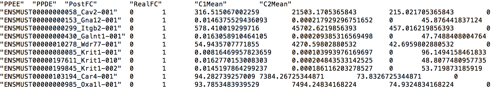

Note that `Galnt1-001` is differentially expressed. However, its parent gene, `Galnt1` is not included in the list of differentially expressed genes. `Galnt1` has 8 isoforms and 4 of them are expressed in at least one sample. The `EBSeq` outputs for these 4 isoforms are:

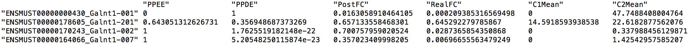

In addition, the `EBSeq` output for the gene is:

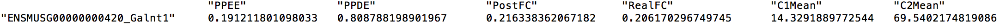

It's easy to see that isoform `Galnt1-201` blurs the effect of isoform `Galnt1-001` and therefore makes gene `Galnt1` not identified as differentially expressed.

## <a name="simulation"></a> Simulation

In this section we will show you how to use RSEM's simulator to guide your design of sequencing experiments. Suppose that sample *LPS_6h* is from a plot project we have conducted and we are interested in gene `Cav2` because it is differentially expressed and supported by existing literature. We want to ask the following two questions:

1. Have we sequenced deeply enough for `Cav2`?
2. If not, how many reads do we need to sequence?

To answer the first question, we need to assess the variablility of our expression estimates. Fortunately, by enabling the `--calc-ci` option, RSEM can provide us the 95% credibility intervals for each isoform / gene. In addition, RSEM will provides the [coefficient of quartile variation (CQV)](https://en.wikipedia.org/wiki/Quartile_coefficient_of_dispersion), which is a robust way to measure the ratio between standard deviation and mean, for each isoform / gene. If `Cav2` has a small CQV, it means that we have enough reads to produce a good estimate. In this tutorial, we will set a threshold of `0.05` on the CQV value.

Type the following command to produce credibility intervals and CQV values for sample `LPS_6h`:

```
../software/RSEM-1.2.24/rsem-calculate-expression -p 8 --paired-end \
						  --bam --no-bam-output \
						  --estimate-rspd \
						  --calc-ci --single-cell-prior \
						  LPS_6h.bam ../ref/mouse_ref LPS_6h_ci
```

In the above command, `--calc-ci` tells RSEM to calculate credibility intervals and CQV values. `--single-cell-prior` tells RSEM to use priors that are suitable for single cell RNA-Seq data. `--no-bam-output` tells RSEM that we do not need the BAM outputs, which can take some time to generate.

From `LPS_6h_ci.genes.results`, we can extract the following numbers for gene `Cav2`:


We can find that `Cav2`'s CQV on the TPM estimate is `0.0644385 > 0.05`, which means that we may need to sequence deeper.

To answer the second question, we need to use RSEM's simulator. The simulator simulate RNA-Seq data based on parameters learned from the real data. Thus we may use the simulated data as a good surrogate. Our strategy is to simulate data at increasing depth and calculate the CQV from RSEM. Once the CQV is below 0.05, we find the right sequencing depth.

As a first try, let us simulate 2 million reads using the following command:

```
../software/RSEM-1.2.24/rsem-simulate-reads ../ref/mouse_ref LPS_6h.stat/LPS_6h.model \
					    LPS_6h.isoforms.results 0.36 2000000 LPS_6h_sim_2M \
					    --seed 0
```

The first argument of `rsem-simulate-reads, `../ref/mouse_ref` tells RSEM where the reference is. Then the second and third arguments, `LPS_6h.stat/LPS_6h.model` and `LPS_6h.isoforms.results` provides the learned sequencing error model and estimated expression levels from real data. The next argument, `0.36`, specifies portion of reads that come from background noise. The first item at the third line of `LPS_6h.stat/LPS_6h.theta` provides an estimate of this portion. Then you specify the number of reads to be simulated, `2000000`, and the output name, `LPS_6h_sim_2M`. Lastly, option `--seed 0` provides RSEM a seed to initialize the random number generator. We set this option to make sure the simulation is replicable. 

When `rsem-simulate-reads` finishes, you should be able to find two FASTQ files containing the simulated reads: `LPS_6h_sim_2M_1.fq` and `LPS_6h_sim_2M_2.fq`.

Let us run RSEM on the simulated data set by typing the following command:

```
../software/RSEM-1.2.24/rsem-calculate-expression -p 8 --paired-end \
						  --bowtie2 --bowtie2-path ../software/bowtie2-2.2.6 \
						  --estimate-rspd \
						  --no-bam-output \
						  --calc-ci --single-cell-prior \
						  LPS_6h_sim_2M_1.fq LPS_6h_sim_2M_2.fq \
						  ../ref/mouse_ref LPS_6h_sim_2M
```

Again, we extract the following numbers for gene `Cav2`, from `LPS_6h_sim_2M.genes.results`:

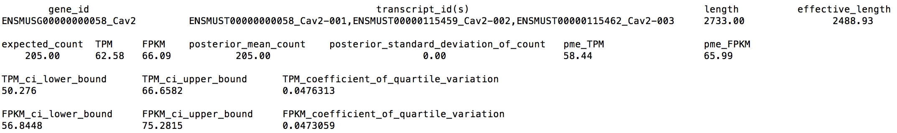

We can find now `Cav2`'s CQV becomes `0.0476313 < 0.05`.


